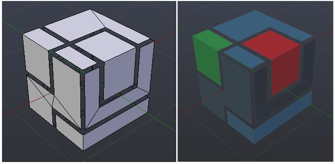
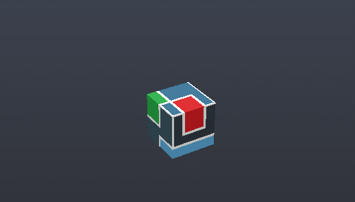

# BJS v3 - 3D logo

## Light version

- only simple planes, colored via vertex color 

## Solid version

  - more complex solid shapes imbrication, colored by vertex colors, edge splitted according to sharp assignation
 - animated, default positions values are saved on frame 0 (volontary not included in animation). At this time animation doesn't work.

## File organization

### Layers

- layer 1: light version
- layer 2: solid version
- layer 9: cam & default light
- layer alt 6: helpers

### How to use & export

- to export, set layers visible as you want
  - examples:
    - layer 9 + 1 = light version
    - layer 9 + 2 = solid version
    - only layer 1 = just light version without cam & light